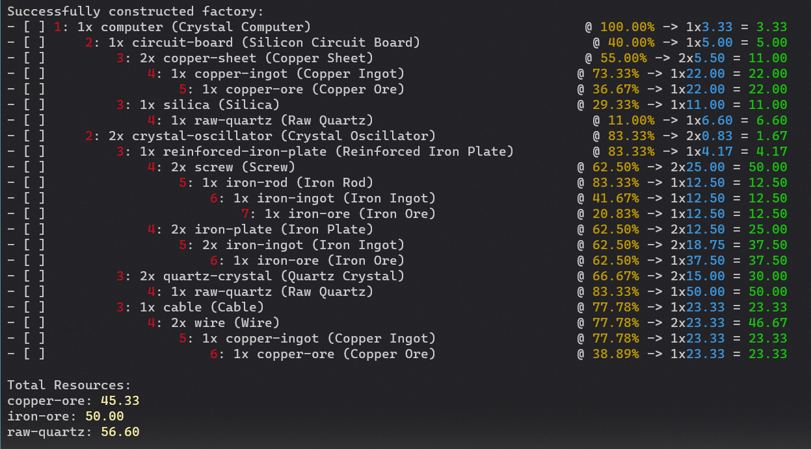
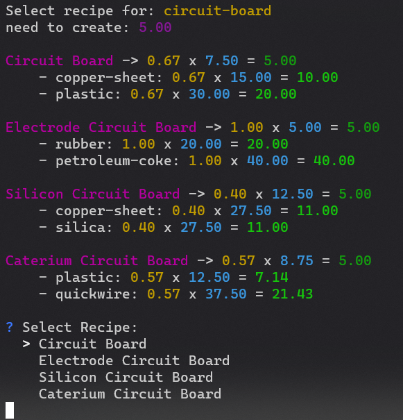

# Satisfactory Factory Calculator
CLI program to generate a text todo list for building a factory.

Example output



Example of Intermediate Recipe Selection



# Features
- For sub-items that need to be created as part of the factory, guides user to select the desired recipe to use
- Indicates all "raw resources" so user can confirm they have all the necessary resources before trying to build the factory
- Calculates factories by underclocking only - never needs power cores
    - Indicates clock percent and target output for each factory to be built by user
- Output formatted in hierarchical order for easy building

# Usage
```
factory_calc.exe {item name} {item recipe}
```

Example: `factory_calc.exe computer "Crystal Computer"`

If don't provide item name or item recipe, will print out available items and/or recipes.

Select the intermediate recipes you would like to use.

## Explanation of Output
The output is a hierarchical list of factories that need to be constructed by the user. Each factory has other factories that feed into it, indicated by the indents. It is recommended to build each level (indicated by the red number) fully before building the next level.

Each line indicates how many copies of builders you need, and what clockrate to set each builder to, in order to generate the total number of needed outputs (green number)

# Development
- Check go.mod for go version requirements
- Check `bin` folder for available build/run commands
- Tests in `lib` folder should all succeed, recommended to use `gotestsum -f testdox`

# Data
Relies on a json data from factorylab. See [online apis](./doc/online_apis.md) for more information on data used.